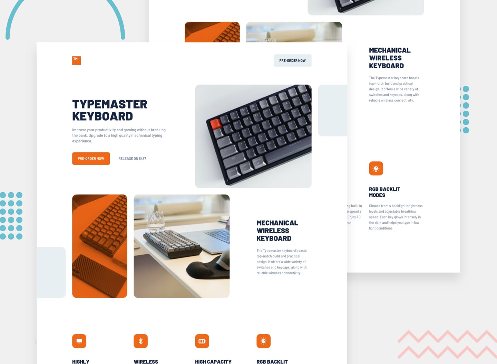

# Typemaster Pre-launch Landing Page

This is a responsive solution to the [Typemaster pre-launch landing page challenge](https://www.frontendmentor.io/challenges/typemaster-prelaunch-landing-page-J6-Yj5J-X) from Frontend Mentor.

## Preview



## Overview

The page promotes the Typemaster mechanical keyboard with:

- A responsive hero section with a pre-order call to action
- Responsive keyboard imagery for mobile, tablet, and desktop layouts
- Product information and feature highlights
- Hover states for the interactive buttons
- Semantic HTML and accessible image treatment

## Built With

- Semantic HTML5
- CSS custom properties
- Flexbox and CSS Grid
- Responsive images with the `<picture>` element
- Mobile-first responsive design
- Local font and image assets

## Run Locally

This project does not require a build step or dependencies.

1. Clone or download the project.
2. Open `index.html` in a browser.

For a local development server, run the project with any static server, such as the VS Code Live Server extension.

## Project Structure

```text
.
├── assets/       # Images, icons, fonts, and favicon
├── design/       # Challenge preview image
├── index.html    # Page markup
└── style.css     # Responsive styles
```

## Links

- [Frontend Mentor challenge](https://www.frontendmentor.io/challenges/typemaster-prelaunch-landing-page-J6-Yj5J-X)
- [Author website](https://rubendeman.nl)

## Acknowledgments

Design and assets provided by [Frontend Mentor](https://www.frontendmentor.io).
